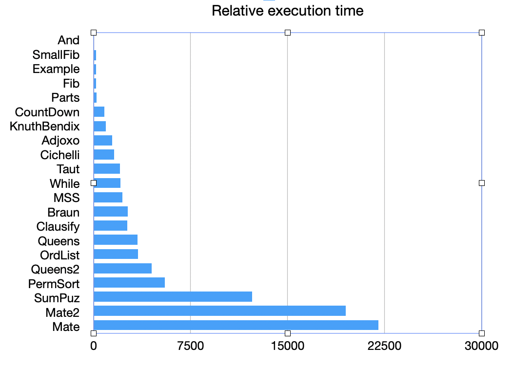

# Benchmarks

## Workloads

The `Makefile` here drives a large set of regression tests on the
26 workloads.  The order of the workloads in the Makefile reflect
expected excution time, especially for Verilog simulation.

## Targets
* regress-emu: Exercises the C emulator on precompiled workloads
* regress-flite-sim: Exercises the Flite simulation on the workloads
* regress-flite-comp: Exercises the Flite compilation on the workloads
* regress-flite-c-comp: Exercises the Flite compilation **to C** on the workloads
* regress-red-verilog-sim: Exercises the Verilog simulation of each workload

(Currently, the workload is baked into the Verilog image which is obviously less than ideal.)